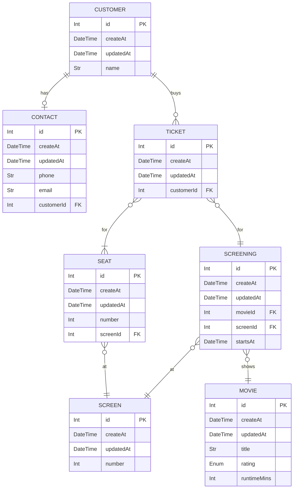

# ERD

```mermaid
erDiagram
    CUSTOMER ||--o| CONTACT : has
    CUSTOMER ||--o{ TICKET : buys
    TICKET }o--|{ SEAT : for
    TICKET }o--|| SCREENING : for
    SEAT }o--|| SCREEN : at
    SCREENING }o--|| MOVIE : shows
    SCREENING }o--|| SCREEN : at

    CUSTOMER {
        Int id PK
        DateTime createAt
        DateTime updatedAt
        Str name
    }

    CONTACT {
        Int id PK
        DateTime createAt
        DateTime updatedAt
        Str phone
        Str email
        Int customerId FK
    }

    TICKET {
        Int id PK
        DateTime createAt
        DateTime updatedAt
        Int customerId FK
    }

    SCREENING {
        Int id PK
        DateTime createAt
        DateTime updatedAt
        Int movieId FK
        Int screenId FK
        DateTime startsAt
    }

    SCREEN {
        Int id PK
        DateTime createAt
        DateTime updatedAt
        Int number
    }

    MOVIE {
        Int id PK
        DateTime createAt
        DateTime updatedAt
        Str title
        Enum rating
        Int runtimeMins
    }

    SEAT {
        Int id PK
        DateTime createAt
        DateTime updatedAt
        Int number
        Int screenId FK
    }
```
