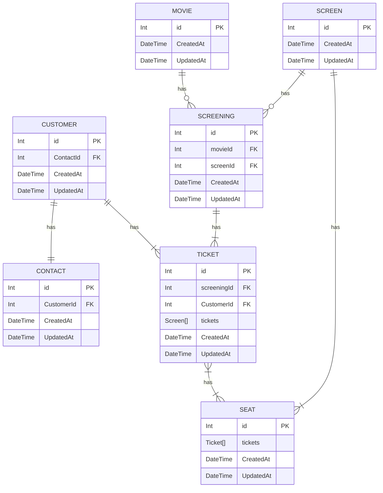

# ERD

```mermaid

erDiagram
    CUSTOMER ||--|| CONTACT : has
    SCREEN ||--o{  SCREENING : has 
    MOVIE ||--o{  SCREENING : has 
    SCREEN ||--|{  SEAT : has 
    SCREENING ||--|{ TICKET : has 
    CUSTOMER ||--|{ TICKET : has 
    TICKET }|--|{  SEAT : has 

    CUSTOMER {
        Int id PK
        Int ContactId FK
        DateTime CreatedAt         
        DateTime UpdatedAt 
    }
    CONTACT {
        Int id PK
        Int CustomerId FK
        DateTime CreatedAt         
        DateTime UpdatedAt 
    }
    SCREENING {
        Int id PK
        Int movieId FK
        Int screenId FK
        DateTime CreatedAt         
        DateTime UpdatedAt 
    }
    SCREEN {
        Int id PK
        DateTime CreatedAt         
        DateTime UpdatedAt 
    }
    MOVIE {
        Int id PK
        DateTime CreatedAt         
        DateTime UpdatedAt 
    }
    TICKET {
        Int id PK
        Int screeningId FK
        Int CustomerId FK
        Screen[] tickets 
        DateTime CreatedAt         
        DateTime UpdatedAt 
    }
    SEAT {
        Int id PK
        Ticket[] tickets 
        DateTime CreatedAt         
        DateTime UpdatedAt 
    }

```
