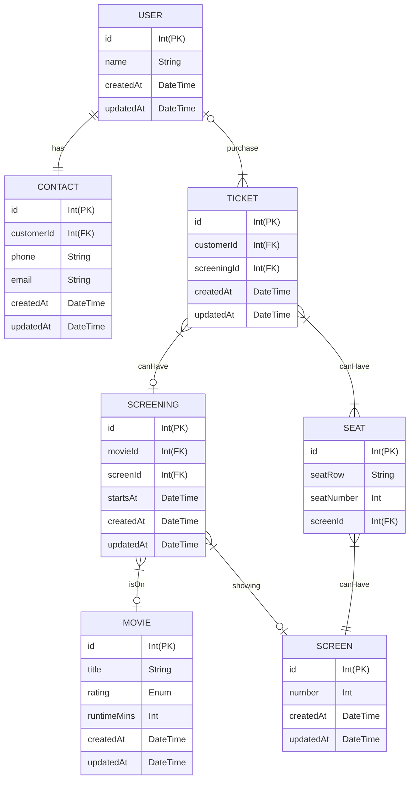

# Enitity Relational Diagram

```mermaid
erDiagram


USER {
    id Int(PK)
    name String
    createdAt DateTime
    updatedAt DateTime
}

USER ||--|| CONTACT : has

CONTACT {
    id Int(PK)
    customerId Int(FK)
    phone String
    email String
    createdAt DateTime
    updatedAt DateTime
}

USER |o--|{ TICKET : purchase

TICKET {
    id Int(PK)
    customerId Int(FK)
    screeningId Int(FK)
    createdAt DateTime
    updatedAt DateTime
}

TICKET }|--o| SCREENING : canHave
TICKET }|--|{ SEAT : canHave

SEAT {
    id Int(PK)
    seatRow String
    seatNumber Int
    screenId Int(FK)
}

SEAT }|--||  SCREEN : canHave

SCREENING {
    id Int(PK)
    movieId Int(FK)
    screenId Int(FK)
    startsAt DateTime
    createdAt DateTime
    updatedAt DateTime
}

SCREENING }|--o| MOVIE : isOn

MOVIE {
    id Int(PK)
    title String
    rating Enum
    runtimeMins Int
    createdAt DateTime
    updatedAt DateTime

}

SCREENING }|--o| SCREEN : showing

SCREEN {
    id Int(PK)
    number Int
    createdAt DateTime
    updatedAt DateTime
}

```
